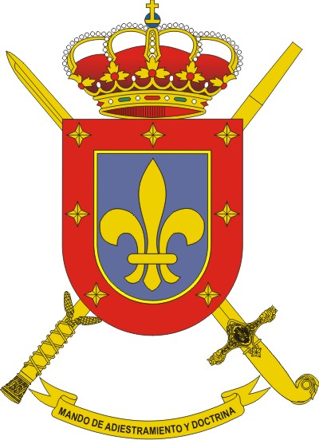

# Aplicación `SICENAD`

## DOCUMENTACIÓN

- Puede consultar la documentación accediendo a la [WIKI](https://git.institutomilitar.com/sicenad/sicenad/wikis/home).

## DESARROLLO

- Es una adaptación de la aplicación para Sharepoint:
- Para ello se crea un subsitio para alojar integramente la aplicación.

### BACKEND

- Se simula la gestión de BBDD sobre **Listas de Sharepoint**, relacionadas entre sí.
- El almacenamiento de archivos se hará en **Bibliotecas de documentos** creadas a tal efecto para cada _CENAD/CMT_.
- Servicios, como la notificación sobre cambios de estado en las distintas solicitudes realizadas, se realizará mediante **Flujos de trabajo de Microsoft Sharepoint Designer**.

### FRONTEND

- Se ha realizado usando Angular 20, utilizando componentes Standalone y el paradigma de señales. Se han adaptado las distintas llamadas _http_ adaptándose a las particularidades de la _api_ que expone Sharepoint.
- Además se han incorporado novedades adaptadas de `Vue`, como la gestión de estados globales.
- La aplicación se construye y se aloja en el subsitio, accediendose a través del navegador siguiendo la ruta "http://colabora.mdef.es/et/COLECCIONSITIOS/SUBSITIO/index.html".
- Se ha desarrollado extrayendo a un archivo de propiedades `properties.txt` el mayor número de parametros, para poder realizar modificaciones o ajustes sin necesidad de volver a construirla. Ejemplo de ello es la definición de colores, tanto de la aplicación como del calendario, los idiomas, tamaños permitidos para cada tipo de archivo, o la propia url de la _API_ donde se alojan los datos.
- Se han utilizado archivos de idiomas, por lo que la aplicación puede servirse en `español`, `inglés`, `francés`, `italiano`, `alemán`, `portugués`, `ruso` y `chino`, pudiendo modificarse en tiempo de ejecución.
- Se ha observado una importante limitación de espacio, en los siguientes aspectos:
  - El espacio total disponible viene limitado por la **Cuota de almacenamiento (Métrica)** de la Colección de Sitios.
  - Las restricciones de tamaño de archivo que regulan la subida de los mismos actualmente está en 150 MB,s.

## FUNCIONALIDADES PRINCIPALES

- Se necesita una aplicación para poder gestionar los recursos de los CENAD,s/CMT,s del Ejército de Tierra.
- La aplicación `SICENAD` permitirá crear y mantener una BD de sus CENAD,s/CMT,s, con sus respectivos recursos, pudiendo administrarse cada CENAD/CMT por sí mismo, pero manteniéndose un control centralizado.
- Cada CENAD/CMT podrá decidir su estructura de recursos y podrá personalizarlos, sin necesidad de ningún conocimiento de programación.
- Cada CENAD/CMT dispondrá además de un repositorio actualizado de cartografía.
- Cada CENAD/CMT mostrará la ocupación de sus recursos en un calendario, que además permitirá, según el rol del usuario, acceder a las solicitudes a las que referencian.
- Cada cambio de estado de una solicitud de un recurso generará automáticamente una notificación (email corporativo) a los usuarios afectados (si han manifestado querer recibir notificaciones).
- Se adjunta un manual de usuario, que estará disponible desde la aplicación, para facilitar el uso de la misma.
